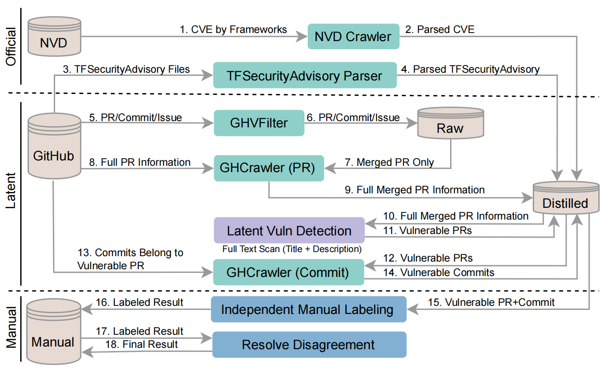

## On Security Weaknesses and Vulnerabilities for Deep Learning Systems

### Abstract

The security guarantee of AI-enabled software systems (particularly using deep learning techniques as a functional core) is pivotal against the adversarial attacks exploiting software vulnerabilities. However, little attention has been paid to a systematic investigation of vulnerabilities in such systems. A common situation learned from the open source software community is that deep learning engineers frequently integrate off-the-shelf or open-source learning frameworks into their ecosystems. In this work, we specifically look into deep learning (DL) framework and perform the first systematic study of vulnerabilities in DL systems through a comprehensive analysis of identified vulnerabilities from Common Vulnerabilities and Exposures (CVE) and open-source DL tools, including TensorFlow, Caffe, OpenCV, Keras, and PyTorch. To this end, we propose a two-stream data analysis framework to explore vulnerability patterns from various databases. We investigate the unique DL frameworks and libraries development ecosystems that appear to be decentralized and fragmented. By revisiting the Common Weakness Enumeration (CWE) List, which provides the traditional software vulnerability related practices, we observed that it is more challenging to detect and fix the vulnerabilities throughout the DL systems lifecycle. Moreover, we conducted a large-scale empirical study of 3,049 DL vulnerabilities to better understand the patterns of vulnerability and the challenges in fixing them.

### Research Requestions

* RQ1: What are the common root causes of deep learning-specific vulnerabilities in the deep learning frameworks?
* RQ2: What are the challenges in detecting the vulnerabilities?
* RQ3: What are the main challenges to fix the vulnerabilities and how to address them?

### Data Collection

<p align="center"></p> 
<p align="center">Figure 1: Data collection and process steps</p>

To collected the manual analysis data for DL system vulnerabilities empirical studies, we implement a data collection process as shown in Figure 1. we collect data from two source a official vulnerability database NVD, and the frameworks' repositories.

* For the official data, we implement a `NVD Crawler` to query the CVE records by DL framework name from NVD database. In addition, for `TensorFlow` which includes well maintained security advisories, we implement `TFSecurityAdvisory Parser` to extract the useful information from all security advisory files. These data will be used as reference to improve the performance of our latent vulnerability detection keywords.

* For the framework repositories, we clone five DL framework projects in local machine and execute `GH Filter` integrated with GitHub CLI command `gh` to extract all Pull Requests (PRs), Commits, and Issues log from these repositories. As `gh` command only return simplified information for the logs, we then run `GHCrawler` to call GitHub REST API to harvest completed `PRs`. Then, we applied a latent vulnerabilities search on the PR records to found those vulnerability patches. Finally, the `GHCrawler` will crawler the completed commits information for corresponding vulnerability patches.

After aforementioned steps, we collects all required data for manual analysis including `Independent Manage Labeling` and `Resolve Disagreement`.

### Data

* `data/raw` contains data directly collect from the source without being manipulated.
* `data/distilled` contains data automatically generated by scrpts or program.
* `data/manual` contains data after manually analysis.

### Usage

To run the project, we need follow these steps:

#### Precondition

1. Before running the code pleasa ensure these directory exist (create them if not).
```bash
data
data/distilled
data/raw
data/manual
```

2. `python3` environment is required for running the project.

3. To use `gh_filter`, the directory pointing to local clone framework repository has to be properly specificed.

4. To use `gh_crawler`, it is required to configure the `auth` parameter in `settings.py`. The `auth` parameter should be filled in GitHub account and token in tuple format e.g. auth:(`<ACCOUNT_NAME>`,`<TOKEN>`)

5. This code has been tested on `Windows 10` and `Mac OS` platform.


#### Step 1: Collect data from NVD database

Run the script

```bash
$ cd src/nvd_crawler
$ python app.py 
```

#### Step 2: Parse data from TensorFlow Security Advisory

You need to manually [download](https://github.com/tensorflow/tensorflow/tree/master/tensorflow/security/advisory) security advisory files and save them into `raw/security_advisory_tensorflow`

Run the script
```bash
$ cd src/tf_security_advisory_parser
$ python app.py 
```

#### Step 3: Extract raw commits, issues, and pull requests

You need to manual clone thoes repositories on your local machine and setup the GitHub CLI environment (as the script call the `gh` command). Then configure settings.py in `src/gh_filter`.

Run the script
```bash
$ cd src/gh_filter
$ python app.py 
```

#### Step 4: Harvest completed pull requests information

Run the script
```bash
$ cd src/gh_crawler
$ python crawler_pr.py 
```

#### Step 5: Apply latent vulnerabilities search on pull request

Run the script
```bash
$ cd src/vuln_detector
$ python app.py 
```

#### Step 6: Harvest completed commits information for vulnerabilities patches (pull requests from step 5)

Run the script
```bash
$ cd src/gh_crawler
$ python crawler_commit.py 
```

After the steps mentioned above, all required data for manual analysis are ready.

### Trouble Shooting

1. If you encounter `SSL` error while running the crawler, you can configure `proxy` in settings file and enable it in the code.
